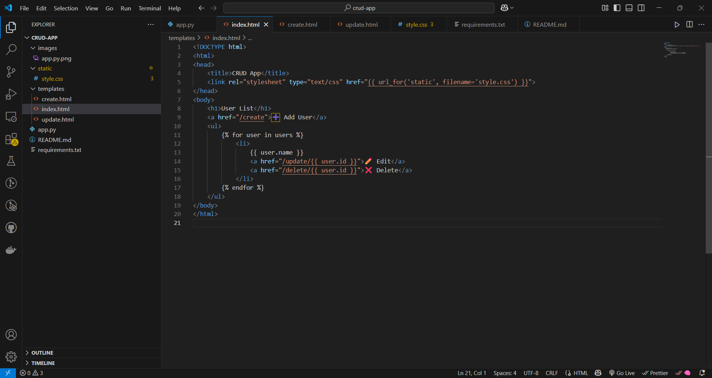
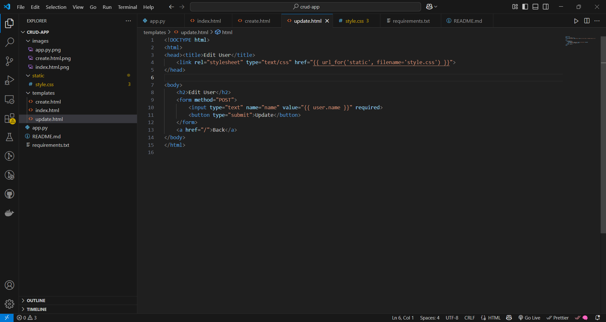
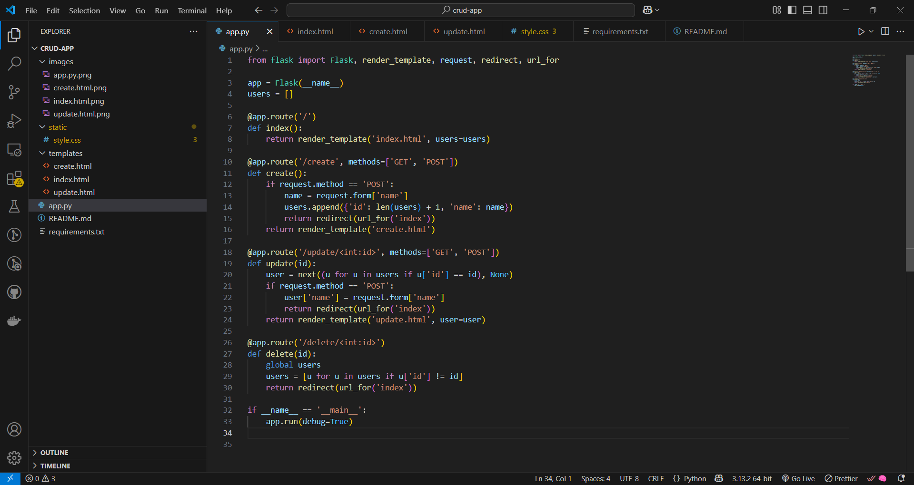
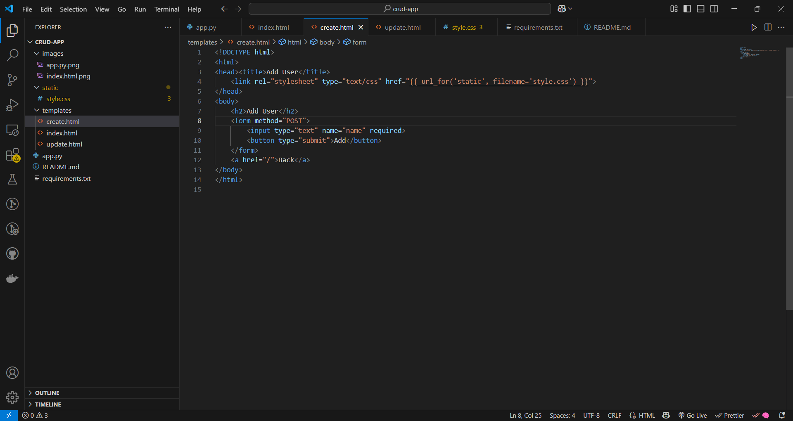
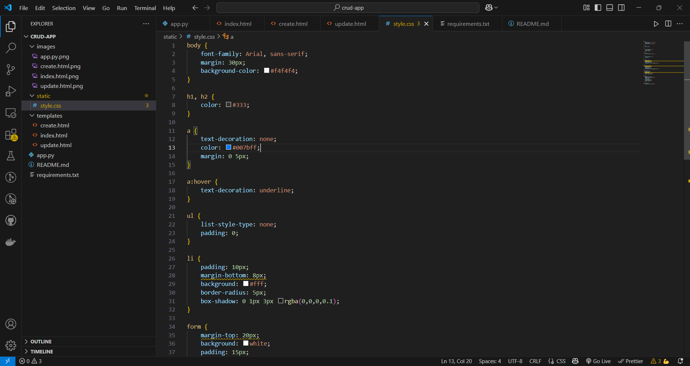
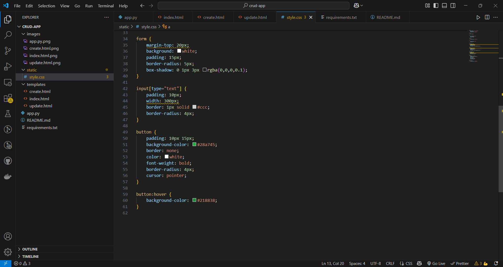

# Flask CRUD App 🧑‍💻

This is a simple **Flask-based CRUD application** for managing users. You can create, read, update, and delete user data through a web interface.

---

## 🚀 Features

- 📝 Add new users  
- 📋 View list of users  
- ✏️ Update user details  
- ❌ Delete users

---

## 📸 Screenshots

## Screenshots

### 1. index.html – Home Page (User List)


This is the main page of the app. It displays a list of all users with their names, along with options to edit or delete each user. There's also a link to navigate to the add user form. The data is rendered using Jinja templating.

### 2. update.html – Update Existing User


This page shows a form with the selected user's current name pre-filled. Users can edit the name and submit the form to update the information via a POST request. A "Back" link is provided to return to the homepage.


### 3. App.py – The Flask Application Logic


This is the core of the application. It initializes Flask, stores user data in memory using a list, and defines all routes:

- `/` – Displays the list of users.
- `/create` – Shows a form and handles submission for adding a new user.
- `/update/<id>` – Displays a form with the user’s current name and allows updating it.
- `/delete/<id>` – Deletes the selected user.

All views are rendered with HTML templates using Jinja, and data is passed between routes via Flask.


### 4.  create.html – Add New User Form


This page displays a simple form with a single input field for the user's name. When submitted, the form sends a POST request to add the new user. It also includes a link to return to the homepage.


### 5.  style.css – Styling the App
## Style Preview 1


## Style Preview 2


This CSS file defines the visual design of the app. It uses a light, clean layout with soft shadows, rounded corners, and subtle hover effects. It styles headers, buttons, forms, links, and list items to improve readability and user experience.


---

## ⚙️ How to Run the Project

### 📦 Requirements

Install Flask:
```bash
pip install flask
```
Or install from requirements.txt:
```bash
pip install -r requirements.txt
```

### ▶️ Run the App
```bash
python app.py
```
Then open your browser and go to:
```bash
http://127.0.0.1:5000
```
### Project Structure
```bash
crud-app/
├── app.py
├── requirements.txt
├── static/
│   └── style.css
├── templates/
│   ├── index.html
│   ├── create.html
│   └── update.html
├── images/
│   └── *.png
└── README.md
```
### 🛠 Tech Stack

Python (Flask)

HTML + CSS


